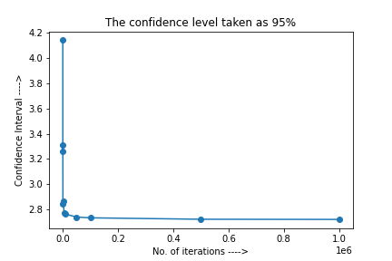

# `Problem 2 - Matrix Multiplication`
- ### Command: `python3 ./q2/runner_script.py /opt/hadoop-3.2.1/share/hadoop/tools/lib/hadoop-streaming-3.2.1.jar ./q2/input.txt /input/ /output2 "./q2/"`

- ### Assumption in command: The `input_formatter.py` should be in the same directory where `mapper.py` and `reducer.py` exists

- Copied the input file, mapper file, reducer file inside the docker container in namenode.

- First of all, I separated the input matrices from original file.

- Preprocessed the local matrix file to output key value pairs of matrix elements where `key` is the combinaton of (row position of the element in the result matrix, column position of the element in the result matrix, position of element in addition in result matrix) and `val` is the actual value of the element in the matrix.

- For example For Matrix input  
`2 2` 
`1 2` 
`3 4` 
`2 2` 
`5 6` 
`7 8` 
The output key value pair would be 
`0000 0000 0000 1` 
`0000 0001 0000 1` 
`0000 0000 0001 2` 
`0000 0001 0001 2` 
`0001 0000 0000 3` 
`0001 0001 0000 3` 
`0001 0000 0001 4` 
`0001 0001 0001 4` 
`0000 0000 0000 5` 
`0001 0000 0000 5` 
`0000 0001 0000 6` 
`0001 0001 0000 6` 
`0000 0000 0001 7` 
`0001 0000 0001 7` 
`0000 0001 0001 8` 
`0001 0001 0001 8` 

- Wrote it in a intermediate file called `intermediate.txt`

- Copied this `intermediate.txt` containing (key, value) pairs to hdfs dfs as input to mapper.

- Mapper rearranges the key value pairs input to it by using as key the elements that are to be multiplied together and that are to be added together during multiplication and passed the result to reducer.

- Value of mapper o/p represents element of either matrix A or matrix B. Key of mapper contains 3 integers i.e. `i` represents row position of the element of the result matrix whose value is to be computed. Similarly, `j` represents column position of the element in the result matrix whose value is to be computed. `k` represents position of element in addition in result matrix whose value is to be computed.

- Reducer multiplies adjacent elements and adds the resultant value elements to form one element of resultant matrix.

# `Problem 3 - Euler's Constant`
- ### Command: `python3 runner_script.py /opt/hadoop-3.2.1/share/hadoop/tools/lib/hadoop-streaming-3.2.1.jar ./q3/input.txt /input/ /output3 "./q3/"`

- I've assumed that only one mapper and one reducer will run in this case.

- Copied the input file, mapper file, reducer file inside the docker container in namenode.

- Then copied the input file inside the docker container to hdfs dfs as input to mapper.

- Mapper generates n key, value pairs as mentioned in the question. The output of mapper has 'V' as key and freq as value.

- Mapper output eaxmple:  
        `2 	 506` 
        `3 	 333` 
        `4 	 117` 
        `5 	 36` 
        `6 	 7` 
        `7 	 1` 

- The reducer adds all the V's multiplied by frequency divided by the sum of all freq to find the expected value of `e`.

- Below is the graph of No. of Iterations vs Accuracy. We can observe that as number of Iteration increases Accuracy also increases.
 

- Below is the graph of No. of Iterations vs Confidence Interval.
 

